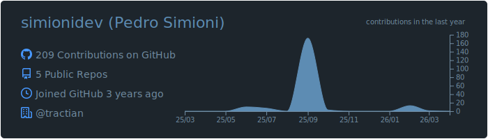
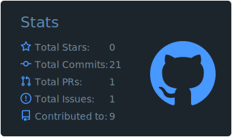
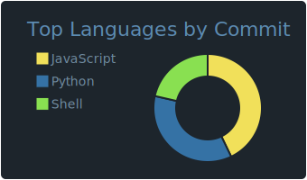
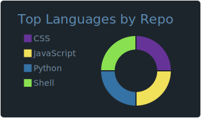
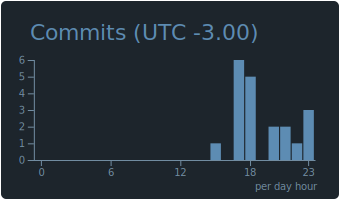

# 📝Sobre Mim

<h3 align="center">Analista de T.I há 2 anos | Formado em Analise e Desenvolvimento de Sistemas | Estudante de Pós Graduação em DevOps e Arquitetura Cloud</a></h3>
  

#  Tecnologias com as quais já trabalhei

<table align="center"><tr><td valign="top" width="50%">

### 
 Frontend 

</td><td valign="top" width="50%">

### 
 Backend 

</td><td valign="top" width="50%">

### 
 Ferramentas 

</td></tr></table>
  

# 📊 Estatisticas do GitHub

# 📫 Vamos Nos Conectar? 

   

  
  

